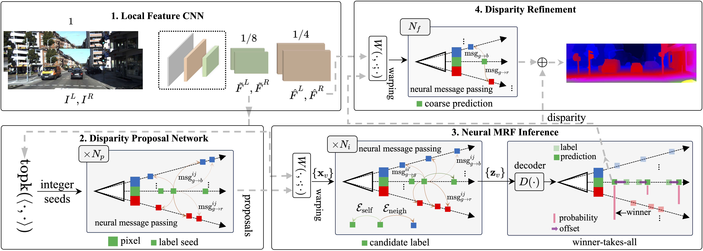
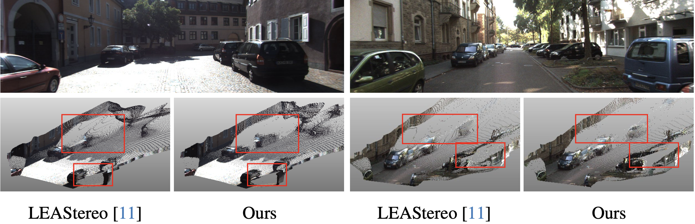

# NMRF-Stereo

Official PyTorch implementation of paper:

[**Neural Markov Random Field for Stereo Matching**](https://arxiv.org/abs/2403.11193), **CVPR 2024**<br/>
Tongfan Guan, Chen Wang, Yun-Hui Liu<br/>

## :new: Updates
- `[2024/07/18]`: :rocket: [NMRF-Stereo-SwinT](docs/swint.md) ranks first on KITTI 2012 and KITTI 2015-NOC, with the ImageNet pretrained [Swin-T](https://github.com/SwinTransformer/storage/releases/download/v1.0.0/swin_tiny_patch4_window7_224.pth) as backbone.

## Introduction
The stereo method of hand-crafted Markov Random Field (MRF) lacks sufficient modeling accuracy compared to end-to-end deep models. While deep learning representations have greatly improved the unary terms of MRF models, the overall accuracy is still severely limited by the hand-crafted pairwise terms and message passing. To address these issues, we propose a neural MRF model, where both potential functions and message passing are designed using data-driven neural networks. Our fully data-driven model is built on the foundation of variational inference theory, to prevent convergence issues and retain stereo MRF's graph inductive bias. To make the inference tractable and scale well to high-resolution images, we also propose a Disparity Proposal Network (DPN) to adaptively prune the search space for every pixel. 



## Highlights

- **High accuracy & efficiency**
  

  NMRF-Stereo reports state-of-the-art accuracy on Scene Flow and ranks first on [KITTI 2012](https://www.cvlibs.net/datasets/kitti/eval_stereo_flow.php?benchmark=stereo) and [KITTI 2015](https://www.cvlibs.net/datasets/kitti/eval_scene_flow.php?benchmark=stereo) leaderboards among all published methods at the time of submission. The model runs at 90ms (RTX 3090) for KITTI data (1242x375).
  
- **Strong cross-domain generalization**

  NMRF-Stereo exhibits great generalization abilities on other dataset/scenes. The model is trained only with synthetic Scene Flow data:

  
  
  
- **Sharp depth boundaries**

  NMRF-Stereo is able to recover sharp depth boundaries, which is key to downstream applications, such as 3D reconstruction and object detection.
  
  

## Installation

Our code is developed on Ubuntu 20.04 using Python 3.8 and PyTorch 1.13. Please note that the code has only been tested with these specified versions. We recommend using [conda]((https://www.anaconda.com/distribution/)) for the installation of dependencies:

1. Create the `NMRF` conda environment and install all dependencies:

```shell
conda env create -f environment.yml
conda activate NMRF
```

2. Build deformable attention and superpixel-guided disparity downsample operator:

```shell
cd ops && sh make.sh && cd ..
```

## Dataset Preparation
To train/evaluate NMRF-Stereo, you will need to download the required datasets.
* [Scene Flow](https://lmb.informatik.uni-freiburg.de/resources/datasets/SceneFlowDatasets.en.html#:~:text=on%20Academic%20Torrents-,FlyingThings3D,-Driving) (Includes FlyingThings3D, Driving & Monkaa)
* [Middlebury](https://vision.middlebury.edu/stereo/data/)
* [ETH3D](https://www.eth3d.net/datasets#low-res-two-view-test-data)
* [KITTI 2012](http://www.cvlibs.net/datasets/kitti/eval_stereo_flow.php?benchmark=stereo)
* [KITTI 2015](http://www.cvlibs.net/datasets/kitti/eval_scene_flow.php?benchmark=stereo)

By default `datasets.py` will search for the datasets in these locations. You can create symbolic links to wherever the datasets were downloaded in the `$root/datasets` folder:

```shell
ln -s $YOUR_DATASET_ROOT datasets
```

Our folder structure is as follows:

```shell
├── datasets
    ├── ETH3D
    │   ├── two_view_training
    │   └── two_view_training_gt
    ├── KITTI
    │   ├── KITTI_2012
    │   │   ├── testing
    │   │   └── training
    │   └── KITTI_2015
    │       ├── testing
    │       └── training
    ├── Middlebury
    │   ├── 2014
    │   └── MiddEval3
    └── SceneFlow
        ├── Driving
        │   ├── disparity
        │   └── frames_finalpass
        ├── FlyingThings3D
        │   ├── disparity
        │   └── frames_finalpass
        └── Monkaa
            ├── disparity
            └── frames_finalpass
```

### (Optional) Occlusion mask

We provide a script to generate occlusion mask for Scene Flow dataset. This may bring **marginal** performance improvement.
```shell
python tools/generate_occlusion_map.py
```


## Demos

Pretrained models can be downloaded from [google drive](https://drive.google.com/drive/folders/1noY4qOR4K9_Eiu7FK0bz4M2bG_WUxmMA?usp=sharing)

We assume the downloaded weights are located under the pretrained directory.

You can demo a trained model on pairs of images. To predict stereo for ETH3D, run
```shell
python inference.py --dataset-name eth3d --output $output_directory SOLVER.RESUME pretrained/sceneflow.pth
```

Or test on your own stereo pairs
```shell
python inference.py --input $left_directory/*.png $right_directory/*.png --output $output_directory SOLVER.RESUME pretrained/$pretrained_model.pth
```

## Evaluation

To evaluate on SceneFlow test set, run

```shell
python main.py --num-gpus 4 --eval-only SOLVER.RESUME pretrained/sceneflow.pth
```

Or for cross-domain generalization:
```shell
python main.py --num-gpus 4 --eval-only --config-file configs/zero_shot_evaluation.yaml SOLVER.RESUME pretrained/sceneflow.pth
```

For submission to KITTI 2012 and 2015 online test sets, you can run:
```shell
python inference.py --dataset-name kitti_2015 SOLVER.RESUME pretrained/kitti.pth
```
and
```shell
python inference.py --dataset-name kitti_2012 SOLVER.RESUME pretrained/kitti.pth
```

## Training
To train on SceneFlow, run
```shell
python main.py --checkpoint-dir checkpoints/sceneflow --num-gpus 4
```
To train on KITTI, run
```shell
python main.py --checkpoint-dir checkpoints/kitti --config-file configs/kitti_mix_train.yaml --num-gpus 4 SOLVER.RESUME pretrained/sceneflow.pth
```

We support using tensorboard to monitor and visualize the training process. You can first start a tensorboard session with

```shell
tensorboard --logdir checkpoints
```

and then access [http://localhost:6006](http://localhost:6066) in your browser.

## Citation
If you find our work useful in your research, please consider citing our paper:

```bibtex
@inproceedings{guan2024neural,
  title={Neural Markov Random Field for Stereo Matching},
  author={Guan, Tongfan and Wang, Chen and Liu, Yun-Hui},
  booktitle={Proceedings of the IEEE/CVF Conference on Computer Vision and Pattern Recognition},
  pages={5459--5469},
  year={2024}
}
```

## Acknowledgements
This project would not have been possible without relying on some awesome repos: [RAFT-Stereo](https://github.com/princeton-vl/RAFT-Stereo), [Detectron2](https://github.com/facebookresearch/detectron2), and [Swin](https://github.com/microsoft/Swin-Transformer).
